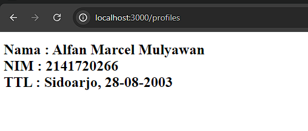

|  | Pemrograman Berbasis Framework 2024 |
| ----------- | --------- |
| NIM | 2141720266 |
| Nama | Alfan Marcel Mulyawan |
| Kelas | TI-3A |

Praktikum 1
membuat sebuah folder bernama profile dan di dalam folder tersebut terdapat file bernama page.tsx. Penamaan folder disini akan berpengaruh pada url yang akan diakses pada routing.

    export default function Profiles() {
        return(
            <h1>
                Nama : Alfan Marcel Mulyawan
                 
                NIM : 2141720266
                 
                TTL : Sidoarjo, 28-08-2003
            </h1>
        )
    }
