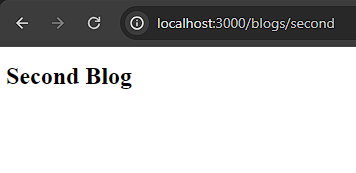
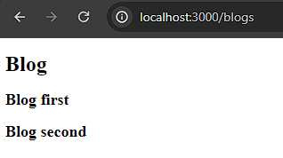
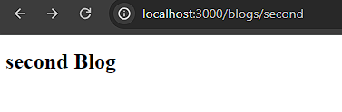
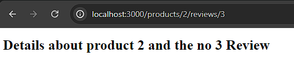
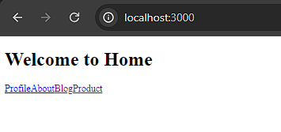

|  | Pemrograman Berbasis Framework 2024 |
| ----------- | --------- |
| NIM | 2141720266 |
| Nama | Alfan Marcel Mulyawan |
| Kelas | TI-3A |

Praktikum 1
membuat sebuah folder bernama profile dan di dalam folder tersebut terdapat file bernama page.tsx. Penamaan folder disini akan berpengaruh pada url yang akan diakses pada routing.

    export default function Profiles() {
        return(
            <h1>
                Nama : Alfan Marcel Mulyawan
                 
                NIM : 2141720266
                 
                TTL : Sidoarjo, 28-08-2003
            </h1>
        )
    }

Praktikum 2
isi page.tsx pada second blog

    export default function SecondBlog() {
        return (
            <h1>Second Blog</h1>
        );
    } 
Output

 - Apa kekurangan yang mungkin terjadi jika menggunakan pendekatan pada Praktikum 2 untuk menangani routing?

* Nested routing dapat membuat kode menjadi lebih kompleks, terutama jika terdapat beberapa tingkat kedalaman nesting. Hal ini dapat membuat sulit untuk memahami aliran navigasi dalam aplikasi.

Praktikum 3

- perbaikan Praktikum 2 dengan <i>Dynamic Routes</i>

page.tsx pada folder blogs

        export default function Blog() {
            return (
                

                    <h1>Blog</h1>
                    <h2>Blog first</h2>
                    <h2>Blog second</h2>
                

                
            );
        }

page.tsx pada folder [blogId]

        type Props = {
            params: {
                blogId: string
            }
        }
        
        export default function BlogDetails({ params }: Props) {
            return (
                <h1>{params.blogId} Blog</h1>
            )
        }

- Dengan menggunakan konsep Nested Routes dan Dynamic Routes, buatlah halaman dengan routing /products/[productId]/reviews/[reviewId]

        type Props = {
            params: {
                productId : string
                reviewId: string
            }
        }
        
        export default function ReviewDetails({ params }: Props) {
            return (
                <h1>Details about product {params.productId} and the no {params.reviewId} Review</h1>
            )
        }

Praktikum 4

- Tambahkan link yang sebelumnya anda telah kerjakan!

        import Link from "next/link";

        export default function Home() {
        return (
                

                <h1>Welcome to Home</h1>
                <Link href='/profile'>Profile</Link>
                <Link href='/about'>About</Link>
                <Link href='/blogs'>Blog</Link>
                <Link href='/products'>Product</Link>
                

        );
        }
dengan output:

dimana jika diklik akan pindah ke halaman yang berhubungan
